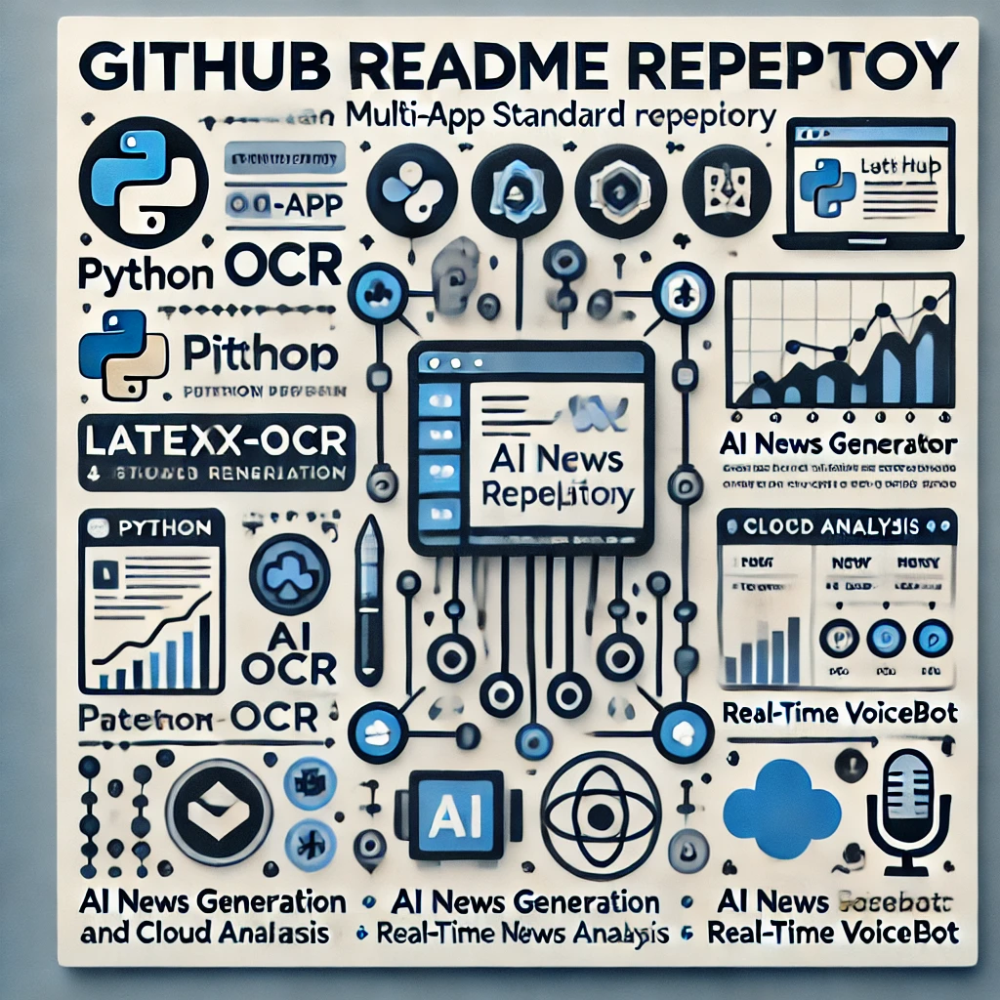

# 🛠️ Multi-AI-Apps-Repository

Welcome to the **Multi-AI-Apps-Repository**! This repository contains various AI-driven projects and applications, including document processing, stock analysis, voicebots, and more.

Each project is contained within its own folder and serves a unique purpose in the AI, NLP, and automation space.

---

## 📋 **Projects Overview**

| **App Name**              | **Latest Commit**                                      | **Description**                                           |
|---------------------------|--------------------------------------------------------|-----------------------------------------------------------|
| `LaTeX-OCR-with-Llama`    | Update README.md                         | Extract LaTeX content from documents using Llama-based OCR. |
| `ai_news_generator`       | Create README.md                           | Generate AI-curated news summaries using NLP techniques. |
| `autogen-stock-analyst`   | Update README.md with correct package    | An AI-powered stock market analysis and report generator. |
| `content_planner_flow`    | Update README.md                           | A tool for automating and planning content creation workflows. |
| `document-chat-rag`       | Added open in studio button              | RAG-based document chatbot for querying and analysis.   |
| `llama-ocr`               | Create README.md (3 weeks ago)                        | OCR engine powered by Llama for text extraction.         |
| `multi-modal-rag`         | Adding tutorial for multimodal prompting | Implements multimodal RAG for combining text and image prompts. |
| `openai-swarm-ollama`     | Updated demo notebook for open-ai swarm | Demo showcasing OpenAI swarm with Ollama integration.    |
| `real-time-voicebot`      | Initial implementation                                | A real-time AI-driven voicebot for live interactions.   |

---

## 🚀 **Getting Started**

Each folder contains its own **`README.md`** with setup instructions and documentation for that specific project. Follow the steps below to explore the projects:

1. Clone the repository:
   ```bash
   git clone https://github.com/sachnaror/Multi-AI-Apps.git
   ```

2. Navigate to the desired app:
   ```bash
   cd <app-name>
   ```

3. Follow the specific setup instructions provided in each app's `README.md`.

---

## 🧩 **Dependencies**

Some common tools and libraries required across these projects include:

- Python 3.8+
- OpenAI API
- Ollama (for Llama models)
- Hugging Face Transformers
- FastAPI (for APIs)
- Streamlit (for UI interfaces)

Refer to each app's documentation for specific dependencies and installation steps.

---

## 💡 **Contributing**

Contributions are welcome! To contribute:

1. Fork the repository.
2. Create a new branch:
   ```bash
   git checkout -b feature/new-feature
   ```
3. Commit your changes:
   ```bash
   git commit -m "Add new feature"
   ```
4. Push to the branch:
   ```bash
   git push origin feature/new-feature
   ```
5. Open a Pull Request.


---

## 📬 **Contact**

For questions or support, reach out to:
- **Email**: schnaror@gmail.com
- **GitHub**: [Your GitHub Profile](https://github.com/sachnaror)

---

**Happy Coding! 🚀**


